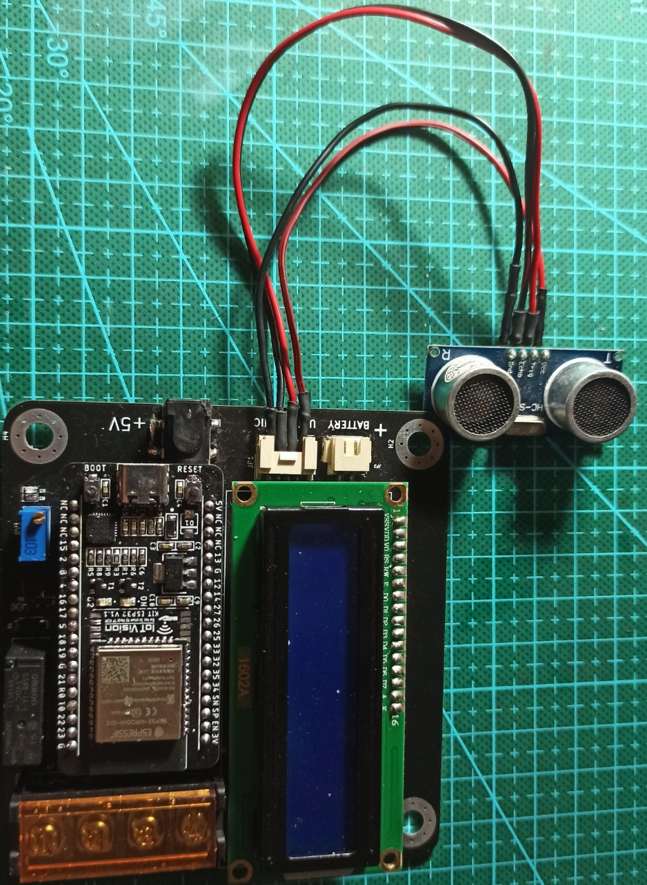

# Máy rửa tay

## Tổng quan

Máy rửa tay phục vụ cho học tập STEM, sử dụnghcảm biến siêu âm HC-SR04 để phát hiện thay đổi khoảng cách, điều khiển relay để đóng ngắt máy bơm và có màn hình LCD 16x2 để hiển thị


## Hướng dẫn sử dụng project

### Yêu cầu phần cứng

Phần cứng sử dụng kit ESP32-WROOM-32E tự build của IoTVisionLab, 1 cảm biến siêu âm 4 pin kết nối với header Grove 2.0mm, một màn hình LCD1602 được điều khiển nhờ IC mở rộng chân PCF8574, ngoài ra để nạp code và log dữ liệu lên máy tính cần sử dụng cáp type-C

### Yêu cầu thư viện

Thư viện sử dụng cho project là CodeFirmwareIoTVision có thể tải [ở đây](https://github.com/IoTVision/CodeFirmwareIoTVision.git) dùng lệnh sau:

```bash
git submodule add <đường link thư viện> <components>
```
#### Bảng kết nối phần cứng:
**Ghi chú**: 
- Có thể gán lại các chân sử dụng thông qua ``menuconfig`` 
- Vì chân I2C không kết nối điện trở kéo lên trên board nên cần cấu hình trở kéo nội
 
| GPIO|   Chức năng     |
|-----|-----------------|
|  27 | Đèn nền LCD     |
|  22 | SCL             |
|  21 | SDA             |
|  25 | HC_SR04 ECHO    |
|  26 | HC_SR04 TRIGGER |

##### Thứ tự chân LCD kết nối với PCF8574:
| PCF8574   | LCD 16x2  |
| --------  | ----------|
|  0        | RS        |
|  2        | E         |
|  4        | D4        |
|  5        | D5        |
|  6        | D6        |
|  7        | D7        |

